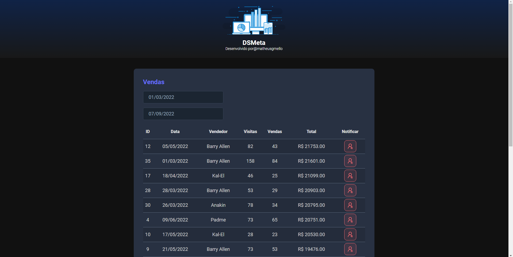

# DSMETA COM SPRING
👨‍🏫SISTEMA DE REGISTRO DE VENDAS QUE PERMITE CONSULTA E PESQUISA EM UMA TABELA DE DADOS DE VENDEDORES.

 <br>
 <br>

## DESCRIÇÃO:
Sistema de Registro de Vendas que permite consulta e pesquisa em uma tabela de dados de vendedores, além de enviar um SMS ao vendedor destaque do mês usando o Twilio SMS.

## FUNCIONALIDADES:
- **Consulta e Pesquisa**: Consulte e pesquise dados de vendas dos vendedores em uma tabela interativa.
- **Notificação por SMS**: Envie uma notificação SMS ao vendedor com melhor desempenho do mês utilizando a API do Twilio.

## COMO USAR?
### BACKEND (API):
1. Entre na pasta `backend`:
    ```sh
    cd backend
    ```
2. Configure o arquivo `application.properties` com as chaves da API do Twilio:
    ```properties
    twilio.accountSid=YOUR_TWILIO_ACCOUNT_SID
    twilio.authToken=YOUR_TWILIO_AUTH_TOKEN
    twilio.phoneNumber=YOUR_TWILIO_PHONE_NUMBER
    ```
3. Rode a aplicação:
    ```sh
    ./mvnw spring-boot:run
    ```

### FRONTEND (WEB):
1. Entre na pasta `frontend`:
    ```sh
    cd frontend
    ```
2. Instale as dependências:
    ```sh
    npm install
    ```
3. Rode a aplicação:
    ```sh
    npm run dev
    ```

## TECNOLOGIAS:
- [JAVA 17](https://github.com/VILHALVA/CURSO-DE-JAVA)
- [SPRING BOOT](https://github.com/VILHALVA/CURSO-DE-SPRING-BOOT)
- [TWILIO API](https://www.twilio.com/docs/usage/api)
- [REACT](https://github.com/VILHALVA/CURSO-DE-REACT)
- [AXIOS](https://axios-http.com/)

## CREDITOS:
- [PROJETO CRIADO PELO "matheusgmello"](https://github.com/matheusgmello/dsmeta)
- [PROJETO EDITADO PELO VILHALVA](https://github.com/VILHALVA)

